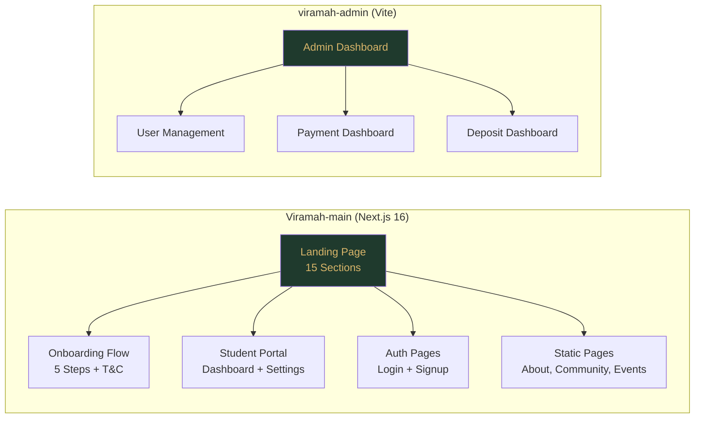

# 🚀 VIRAMAH — Frontend Optimization & Mobile Responsiveness Master Plan

> **Scope**: `Viramah-main` (Next.js 16, Tailwind v4) + `viramah-admin` (Vite + React, vanilla CSS)  
> **Goal**: Production-grade performance, pixel-perfect mobile responsiveness across all screen sizes, and buttery-smooth touch UX

---

## Architecture Overview



---

## Phase 1 — Performance & Bundle Optimization
**Priority: 🔴 CRITICAL** | Effort: ~4 hours

### 1.1 Next.js Build Optimization

| Change | File | Impact |
|--------|------|--------|
| Enable React Compiler (already on ✅) | `next.config.ts` | Auto-memoization |
| Add `experimental.optimizeCss: true` | `next.config.ts` | CSS tree-shaking |
| Enable `bundlePagesRouterDependencies` | `next.config.ts` | Smaller page bundles |
| Add `experimental.turbo.treeshaking: true` | `next.config.ts` | Dead code elimination |

> [!TIP]
> The React Compiler is already enabled — this automatically memoizes components. No need for manual `React.memo` wrappers.

### 1.2 Code Splitting & Lazy Loading

**Current state**: Already using `next/dynamic` for below-fold sections ✅. But improvements needed:

```diff
 // page.tsx — add loading skeletons for dynamic sections
-const CategoriesSection = dynamic(() => import("...").then(m => m.CategoriesSection), { ssr: true });
+const CategoriesSection = dynamic(() => import("...").then(m => m.CategoriesSection), {
+  ssr: true,
+  loading: () => <div className="h-[400px] animate-pulse bg-sand-dark/30 rounded-lg" />
+});
```

**Files to update**:
- [page.tsx](file:///c:/Users/sansk/OneDrive/Desktop/VIRAMAH/Viramah-main/src/app/page.tsx) — Add loading skeletons for all 8 dynamic imports
- [ScheduleVisitModal.tsx](file:///c:/Users/sansk/OneDrive/Desktop/VIRAMAH/Viramah-main/src/components/ui/ScheduleVisitModal.tsx) (66KB!) — Split into smaller chunks
- [EnquiryModal.tsx](file:///c:/Users/sansk/OneDrive/Desktop/VIRAMAH/Viramah-main/src/components/ui/EnquiryModal.tsx) (57KB!) — Extract location data to separate JSON

### 1.3 Font Loading Strategy

**Current state**: Good — `display: "swap"` + `preload: true` for display/body fonts ✅

**Improvement**: Extract the massive inline `LOCATION_DATA` from EnquiryModal into a lazy-loaded JSON:

```
src/data/locations.json    ← ~4KB gzipped instead of bloating JS bundle
```

### 1.4 Third-Party Script Optimization

**Current state**: GA4 uses `afterInteractive`, Meta Pixel uses `lazyOnload` ✅

**Improvement**: Add `dns-prefetch` and `preconnect` hints:

```html
<!-- layout.tsx <head> -->
<link rel="dns-prefetch" href="https://www.googletagmanager.com" />
<link rel="dns-prefetch" href="https://connect.facebook.net" />
<link rel="preconnect" href="https://fonts.gstatic.com" crossOrigin="anonymous" />
```

---

## Phase 2 — Image & Asset Pipeline
**Priority: 🔴 CRITICAL** | Effort: ~3 hours

### 2.1 Image Optimization Audit

| Issue | Fix | Files |
|-------|-----|-------|
| Room images use `.png` (~2-5MB each) | Convert to `.webp` at build time or use Next.js Image auto-format | `page.tsx` room cards |
| Hero carousel loads all images eagerly | Add `loading="lazy"` to non-visible tiles | [HeroSection.tsx](file:///c:/Users/sansk/OneDrive/Desktop/VIRAMAH/Viramah-main/src/components/sections/HeroSection.tsx) |
| Missing `priority` on hero first tile | Add `priority` to first visible image | HeroSection.tsx |
| `sizes` prop missing on some images | Add responsive `sizes` for proper srcset selection | All `<Image>` components |

### 2.2 Static Asset Caching

**Current state**: 1-year cache on static assets ✅. But:

```diff
 // next.config.ts — add font caching
 {
   source: "/(.*)\\.(jpg|jpeg|png|gif|webp|avif|svg|ico|woff|woff2)",
+  // Also add js/css for better cache hits
+  source: "/(.*)\\.(jpg|jpeg|png|gif|webp|avif|svg|ico|woff|woff2|js|css)",
   headers: [{ key: "Cache-Control", value: "public, max-age=31536000, immutable" }],
 },
```

### 2.3 SVG Optimization

- Extract inline SVGs (WhatsApp, Phone icons in EnquiryModal) into reusable components
- Use `<svg>` with `aria-hidden` for decorative icons

---

## Phase 3 — Mobile Responsiveness Audit (Section-by-Section)
**Priority: 🔴 CRITICAL** | Effort: ~8 hours

> [!IMPORTANT]
> Each section has its own CSS file. I'll audit every single one for mobile gaps and fix them.

### 3.1 Global Foundation Fixes

**File**: [globals.css](file:///c:/Users/sansk/OneDrive/Desktop/VIRAMAH/Viramah-main/src/styles/globals.css)

```diff
 @layer base {
   html {
     scroll-behavior: smooth;
+    /* Prevent horizontal overflow on all mobile devices */
+    overflow-x: hidden;
   }

+  /* Safe area insets for notched phones (iPhone X+, etc.) */
+  body {
+    padding-top: env(safe-area-inset-top);
+    padding-bottom: env(safe-area-inset-bottom);
+    padding-left: env(safe-area-inset-left);
+    padding-right: env(safe-area-inset-right);
+  }
 }
```

### 3.2 Section-by-Section Responsive Fixes

#### 🏠 Hero Section — [hero-section.css](file:///c:/Users/sansk/OneDrive/Desktop/VIRAMAH/Viramah-main/src/styles/hero-section.css)
**Status**: Good responsive coverage ✅ (phones, tablets, landscape, XS)
**Fixes needed**:
- [ ] Hero title `font-size: clamp(3rem, 14vw, 5rem)` can overflow on some phones — test at 360px
- [ ] `.hero-blurbs` vertical layout padding needs refinement below 375px
- [ ] Add `scroll-snap-align: center` to tiles for native-feeling swipe on mobile

#### 🏆 Difference Section — [difference-section.css](file:///c:/Users/sansk/OneDrive/Desktop/VIRAMAH/Viramah-main/src/styles/difference-section.css)
- [ ] Audit grid collapse from multi-column to single column below 640px
- [ ] Ensure comparison cards don't horizontally overflow
- [ ] Test table/card text readability at 320px

#### 🏠 Categories Section — [categories-section.css](file:///c:/Users/sansk/OneDrive/Desktop/VIRAMAH/Viramah-main/src/styles/categories-section.css)
- [ ] Category card grid: ensure 2-column layout on phones, 1-column on XS
- [ ] Check image aspect ratios at mobile breakpoints
- [ ] Font size scaling for card titles

#### ⚡ Amenities Section — [amenities-section.css](file:///c:/Users/sansk/OneDrive/Desktop/VIRAMAH/Viramah-main/src/styles/amenities-section.css)
**Status**: Excellent granular breakpoints (6 breakpoints!) ✅
**Fixes needed**:
- [ ] At 320px, 2-col grid with `aspect-ratio: 1/0.95` may clip icon labels
- [ ] Remove `will-change: transform` from `.amen-cell` on mobile (unnecessary, wastes memory)

#### 🍽 Food Section — [food-section.css](file:///c:/Users/sansk/OneDrive/Desktop/VIRAMAH/Viramah-main/src/styles/food-section.css)
- [ ] Check food menu card layout at mobile
- [ ] Image loading and placeholder behavior

#### 🌿 Life at Viramah — [life-at-viramah-section.css](file:///c:/Users/sansk/OneDrive/Desktop/VIRAMAH/Viramah-main/src/styles/life-at-viramah-section.css)
- [ ] Masonry/gallery grid collapse behavior
- [ ] Touch scroll behavior for horizontal elements

#### 🤝 Community Section — [community-section.css](file:///c:/Users/sansk/OneDrive/Desktop/VIRAMAH/Viramah-main/src/styles/community-section.css)
- [ ] Card stack layout on mobile
- [ ] Text truncation rules

#### 👤 Founder Section — [founder-section.css](file:///c:/Users/sansk/OneDrive/Desktop/VIRAMAH/Viramah-main/src/styles/founder-section.css)
- [ ] Image + text side-by-side to stacked transition
- [ ] Quote typography at small screens

#### ❓ FAQ Section — [faq-section.css](file:///c:/Users/sansk/OneDrive/Desktop/VIRAMAH/Viramah-main/src/styles/faq-section.css)
- [ ] Accordion touch targets (minimum 44px height)
- [ ] Answer text readability

#### 🦶 Footer — [footer-section.css](file:///c:/Users/sansk/OneDrive/Desktop/VIRAMAH/Viramah-main/src/styles/footer-section.css)
**Status**: Good responsive coverage ✅ (tablet + mobile + XS)
**Fixes needed**:
- [ ] Map iframe `height: 175px` may be too tall on 320px screens
- [ ] Social buttons spacing on XS phones
- [ ] Bottom bar text wrapping at very small widths

#### 📋 CTA Section — [cta-section.css](file:///c:/Users/sansk/OneDrive/Desktop/VIRAMAH/Viramah-main/src/styles/cta-section.css)
- [ ] CTA button sizing on mobile (full-width recommended)
- [ ] Background pattern performance on low-end devices

#### 🗣 Testimonials — [testimonials-section.css](file:///c:/Users/sansk/OneDrive/Desktop/VIRAMAH/Viramah-main/src/styles/testimonials-section.css)
- [ ] Carousel/slider touch behavior
- [ ] Card width at mobile breakpoints

#### 📄 Why Viramah — [why-viramah.css](file:///c:/Users/sansk/OneDrive/Desktop/VIRAMAH/Viramah-main/src/styles/why-viramah.css)
- [ ] Feature cards grid collapse
- [ ] Icon sizing at mobile

#### ℹ️ About Page — [about-page.css](file:///c:/Users/sansk/OneDrive/Desktop/VIRAMAH/Viramah-main/src/styles/about-page.css)
- [ ] Full responsive audit of separate page layout
- [ ] Image gallery behavior
- [ ] Value cards stacking

#### 🔒 Privacy Page — [privacy-page.css](file:///c:/Users/sansk/OneDrive/Desktop/VIRAMAH/Viramah-main/src/styles/privacy-page.css)
- [ ] Long-form text readability at mobile
- [ ] ToC navigation on small screens

### 3.3 Navigation Responsiveness

**File**: [Navigation.tsx](file:///c:/Users/sansk/OneDrive/Desktop/VIRAMAH/Viramah-main/src/components/layout/Navigation.tsx)

**Status**: Has mobile hamburger menu ✅

**Fixes needed**:
- [ ] Mobile menu dropdown clips at bottom on short screens — add `max-height: calc(100vh - 120px)` with overflow scroll
- [ ] Nav bar `h-[60px]` on mobile needs padding above fold content — verify all page content starts below 60px + safe area
- [ ] "Join Us" button (`EnquireNowButton`) text may truncate at narrow widths — test at 320px
- [ ] Add `overscroll-behavior: contain` to mobile menu to prevent body scroll leak

### 3.4 Room Cards Responsiveness

**File**: [RoomCard.tsx](file:///c:/Users/sansk/OneDrive/Desktop/VIRAMAH/Viramah-main/src/components/ui/RoomCard.tsx)

**Fixes needed**:
- [ ] Image carousel arrows `opacity-0 group-hover:opacity-100` — always visible on touch devices
- [ ] 3D tilt effect (`rotateX`, `rotateY`) should be disabled on mobile (wastes GPU, looks broken on touch)
- [ ] Carousel dot indicators too small for touch (1.5px dots) — increase to minimum 8px
- [ ] Price text `font-size: 1.7rem` may overflow on narrow cards — test grid at 320px
- [ ] The ⭐ Popular ribbon CSS overflows on very narrow cards

```diff
 // RoomCard.tsx — disable 3D tilt on touch devices
-style={{ rotateX, rotateY, transformStyle: "preserve-3d" }}
+style={{
+  ...(typeof window !== 'undefined' && 'ontouchstart' in window
+    ? {}
+    : { rotateX, rotateY, transformStyle: "preserve-3d" }),
+}}
```

---

## Phase 4 — Touch UX & Mobile Interactions
**Priority: 🟡 HIGH** | Effort: ~4 hours

### 4.1 Swipe Gestures for Carousels

**Target components**:
- Hero marquee tiles (currently auto-scrolling marquee)
- Room card image carousels
- Testimonials section

```
Implementation: Use framer-motion's drag gesture API:
- `drag="x"` + `dragConstraints` for bounded swipe
- `onDragEnd` velocity detection for momentum-based slide
- Snap points aligned to card boundaries
```

### 4.2 Tap vs. Hover State Management

**Current issue**: Several components only reveal content on `:hover`, which doesn't work on touch:

| Component | Current Behavior | Fix |
|-----------|-----------------|-----|
| Hero tiles | Overlay shows on hover only | ✅ Already has `.hero-tile-active` class for touch |
| Room card arrows | `opacity-0 group-hover:opacity-100` | Always show arrows on touch devices |
| Footer nav links | `translateX(6px)` on hover | Remove transform on touch |
| Social icons | `translateY(-3px)` on hover | Remove transform on touch |

### 4.3 Touch Target Sizing (WCAG AA)

**Minimum**: 44×44px for all interactive elements

**Files to audit**:
- Navigation mobile menu items — currently `py-3.5` ≈ 52px ✅
- Room card carousel dots — **⚠️ 1.5px×1.5px, far too small** → fix to 12px×12px
- FAQ accordion headers — verify height
- Footer social buttons — `38×38px` → increase to 44×44px
- Form inputs in all modals

### 4.4 Scroll Snap for Horizontal Sections

```css
/* Add to applicable horizontal-scroll sections */
.scroll-snap-container {
  scroll-snap-type: x mandatory;
  -webkit-overflow-scrolling: touch;
}

.scroll-snap-item {
  scroll-snap-align: center;
}
```

---

## Phase 5 — Form & Modal Mobile Optimization
**Priority: 🟡 HIGH** | Effort: ~5 hours

### 5.1 Enquiry Modal Mobile UX

**File**: [EnquiryModal.tsx](file:///c:/Users/sansk/OneDrive/Desktop/VIRAMAH/Viramah-main/src/components/ui/EnquiryModal.tsx)

**Issues**:
- [ ] Modal at `max-height: 90vh` — on mobile with virtual keyboard open, form fields are obscured
- [ ] Fixed side-action buttons (WhatsApp, Enquire, Call) at `width: 42px` can overlap content on small screens
- [ ] `FancySelect` dropdown uses `position: fixed` with viewport coords — breaks when virtual keyboard pushes viewport
- [ ] Form input padding changes on focus (`paddingLeft: focused ? 8 : 0`) — causes layout jank on mobile

```diff
 // Fix: Use visualViewport API for keyboard-aware positioning
+useEffect(() => {
+  if (!isOpen || typeof window === 'undefined') return;
+  const vv = window.visualViewport;
+  if (!vv) return;
+  const handler = () => {
+    const panel = document.querySelector('[role="dialog"]');
+    if (panel) (panel as HTMLElement).style.maxHeight = `${vv.height - 20}px`;
+  };
+  vv.addEventListener('resize', handler);
+  return () => vv.removeEventListener('resize', handler);
+}, [isOpen]);
```

### 5.2 Schedule Visit Modal (66KB!)

**File**: [ScheduleVisitModal.tsx](file:///c:/Users/sansk/OneDrive/Desktop/VIRAMAH/Viramah-main/src/components/ui/ScheduleVisitModal.tsx)

- [ ] Audit for same modal height/keyboard issues as EnquiryModal
- [ ] Consider splitting the date picker into a separate lazy chunk
- [ ] Ensure calendar grid is touch-friendly at mobile widths

### 5.3 Onboarding Forms

**File**: [user-onboarding/layout.tsx](file:///c:/Users/sansk/OneDrive/Desktop/VIRAMAH/Viramah-main/src/app/user-onboarding/layout.tsx) (28KB)

- [ ] Multi-step form stepper horizontal overflow on mobile
- [ ] File upload (KYC docs, profile photo) touch UX
- [ ] Form validation error visibility on small screens
- [ ] Sticky submit button at bottom of viewport on mobile

### 5.4 Login & Signup Pages

- [ ] Social login buttons full-width on mobile
- [ ] Password visibility toggle touch target
- [ ] OTP input field sizing on mobile
- [ ] Error toast positioning (avoid overlap with keyboard)

---

## Phase 6 — Admin Panel Mobile Responsiveness
**Priority: 🟠 MEDIUM** | Effort: ~6 hours

> [!NOTE]
> The admin panel (`viramah-admin`) uses vanilla CSS with a fixed sidebar layout. This is the biggest mobile gap in the platform.

### 6.1 Sidebar Collapse to Hamburger

**File**: [index.css](file:///c:/Users/sansk/OneDrive/Desktop/VIRAMAH/viramah-admin/src/index.css) — Lines 257-448

**Current**: `--sidebar-width: 160px`, `position: fixed`, no mobile breakpoint!

```css
/* === Mobile Sidebar Fix === */
@media (max-width: 768px) {
  :root {
    --sidebar-width: 0px;
  }

  .sidebar {
    transform: translateX(-100%);
    width: 260px;
    transition: transform 0.3s var(--easing);
    z-index: 1000;
  }

  .sidebar.open {
    transform: translateX(0);
  }

  .main-content {
    margin-left: 0;
  }

  /* Mobile hamburger toggle */
  .mobile-menu-toggle {
    display: flex;
    position: fixed;
    top: 12px;
    left: 12px;
    z-index: 1001;
    width: 44px;
    height: 44px;
    align-items: center;
    justify-content: center;
    background: var(--primary);
    color: var(--accent);
    border-radius: var(--radius);
    box-shadow: var(--shadow-md);
  }

  /* Overlay */
  .sidebar-overlay {
    position: fixed;
    inset: 0;
    background: rgba(0, 0, 0, 0.5);
    z-index: 999;
  }
}

@media (min-width: 769px) {
  .mobile-menu-toggle,
  .sidebar-overlay {
    display: none !important;
  }
}
```

### 6.2 Dashboard Cards & Stats Grid

**File**: [index.css](file:///c:/Users/sansk/OneDrive/Desktop/VIRAMAH/viramah-admin/src/index.css) — `.stats-grid`, `.content-grid`

```css
@media (max-width: 768px) {
  .stats-grid {
    grid-template-columns: 1fr 1fr;
    gap: 12px;
  }

  .content-grid {
    grid-template-columns: 1fr;
  }

  .page {
    padding: 16px;
  }

  .page-title {
    font-size: 1.4rem;
  }

  .stats-card {
    padding: 16px;
  }

  .stats-card-value {
    font-size: 1.4rem;
  }

  .stats-card-icon {
    width: 40px;
    height: 40px;
  }
}

@media (max-width: 480px) {
  .stats-grid {
    grid-template-columns: 1fr;
  }
}
```

### 6.3 Data Tables

**Current**: Tables overflow horizontally with no indication. Need:

```css
@media (max-width: 768px) {
  .table-container {
    position: relative;
    overflow-x: auto;
    -webkit-overflow-scrolling: touch;
    /* Fade hint for horizontal scroll */
    mask-image: linear-gradient(to right, black 90%, transparent);
  }

  .table td, .table th {
    padding: 10px 12px;
    font-size: 0.8rem;
    white-space: nowrap;
  }

  /* Stack certain columns vertically on very small screens */
  .table .responsive-stack {
    display: flex;
    flex-direction: column;
    gap: 2px;
  }
}
```

### 6.4 User Profile Modal

**File**: [UserProfileModal.tsx](file:///c:/Users/sansk/OneDrive/Desktop/VIRAMAH/viramah-admin/src/components/UserProfileModal.tsx) (16KB)

- [ ] Full-screen on mobile instead of centered overlay
- [ ] Tab navigation horizontal scroll for mobile
- [ ] Document thumbnails grid collapse
- [ ] Action buttons full-width on mobile

### 6.5 Payment & Deposit Dashboards

**Files**: 
- [PaymentDashboard.tsx](file:///c:/Users/sansk/OneDrive/Desktop/VIRAMAH/viramah-admin/src/pages/admin/PaymentDashboard.tsx) (21KB)
- [DepositDashboard.tsx](file:///c:/Users/sansk/OneDrive/Desktop/VIRAMAH/viramah-admin/src/pages/admin/DepositDashboard.tsx) (38KB)

- [ ] Filter bar wrapping on mobile
- [ ] Payment card layouts responsive collapse
- [ ] Receipt print view already print-ready ✅

---

## Phase 7 — Core Web Vitals & Lighthouse Polish
**Priority: 🟡 HIGH** | Effort: ~3 hours

### 7.1 Cumulative Layout Shift (CLS)

| Issue | Fix |
|-------|-----|
| Font loading causes text reflow | ✅ Already using `display: swap` |
| Images without dimensions cause layout shift | Add explicit `width`/`height` or `aspect-ratio` to all `<Image>` |
| Dynamic content injection (modals, toasts) | Use `position: fixed` (already done ✅) |
| Lazy-loaded sections cause content jump | Add `min-height` to dynamic section wrappers |

### 7.2 Largest Contentful Paint (LCP)

**Target**: < 2.5s

- [ ] Preload hero background image with `<link rel="preload">`
- [ ] Add `fetchpriority="high"` to hero first tile image
- [ ] Inline critical CSS for above-fold content
- [ ] Defer non-critical CSS (community, events sections)

### 7.3 First Input Delay (FID) / Interaction to Next Paint (INP)

- [ ] Remove `will-change` from non-animated elements on mobile (saves compositor memory)
- [ ] Debounce scroll listeners (Navigation already uses RAF ✅)
- [ ] Use `startTransition` for non-urgent state updates in forms
- [ ] Ensure no layout thrashing in `IntersectionObserver` callbacks

### 7.4 Accessibility (a11y)

- [ ] All interactive elements need `aria-label` or visible text
- [ ] Color contrast ratios for muted text (`opacity: 0.4` on light backgrounds)
- [ ] Focus ring visibility on all focusable elements
- [ ] Skip-to-content link for keyboard navigation
- [ ] `prefers-reduced-motion` media queries (already good on hero + footer ✅)

---

## Implementation Priority Matrix

```mermaid
quadrant-chart
    title Effort vs Impact
    x-axis Low Effort --> High Effort
    y-axis Low Impact --> High Impact
    quadrant-1 "Do First"
    quadrant-2 "Plan Carefully"
    quadrant-3 "Quick Wins"
    quadrant-4 "Deprioritize"
    "Room Card touch fix": [0.3, 0.85]
    "Admin sidebar collapse": [0.6, 0.9]
    "Modal keyboard fix": [0.4, 0.8]
    "Image optimization": [0.35, 0.75]
    "Carousel swipe": [0.5, 0.7]
    "Touch targets fix": [0.25, 0.65]
    "CLS prevention": [0.3, 0.6]
    "Onboarding mobile": [0.7, 0.85]
    "Admin tables": [0.55, 0.6]
    "Font preloading": [0.15, 0.45]
    "SVG extraction": [0.4, 0.3]
    "Bundle splitting": [0.65, 0.55]
```

---

## Recommended Execution Order

### Sprint 1 — Quick Wins (Day 1)
1. ✅ Global CSS safe-area and overflow fixes
2. ✅ Room Card mobile touch fixes (arrows, dots, disable 3D tilt)
3. ✅ Navigation mobile menu max-height + overflow
4. ✅ Touch target sizing audit + fixes
5. ✅ Image `sizes` prop and `priority` fixes

### Sprint 2 — Critical Mobile (Day 2)
6. Admin panel sidebar mobile collapse (hamburger menu)
7. Admin tables responsive wrapper
8. Admin stats grid responsive breakpoints
9. Enquiry/ScheduleVisit modal keyboard-aware height
10. Side action buttons (WhatsApp/Call/Enquire) repositioning on mobile

### Sprint 3 — Section Polish (Day 3)
11. Per-section CSS responsive audit (all 15+ CSS files)
12. Onboarding flow mobile optimization (stepper, forms, uploads)
13. Student portal mobile layout
14. Login/Signup pages mobile refinement

### Sprint 4 — Performance & Metrics (Day 4)
15. Bundle size analysis + splitting
16. Image pipeline optimization (convert to WebP, lazy loading)
17. Core Web Vitals measurement + fixes
18. Lighthouse audit run + score targets (90+ on mobile)
19. Production build validation

---

## Key Device Test Matrix

| Device | Width | Key Testing Areas |
|--------|-------|-------------------|
| iPhone SE | 375×667 | Touch targets, font scaling, modals |
| iPhone 14 Pro | 393×852 | Dynamic Island safe area, notch |
| iPhone 14 Pro Max | 430×932 | Large phone layout, padding |
| Samsung Galaxy S21 | 360×800 | Standard Android baseline |
| Galaxy Fold (folded) | 280×653 | Extreme narrow width |
| iPad Mini | 768×1024 | Tablet portrait breakpoint |
| iPad Air | 820×1180 | Tablet landscape grid |
| Pixel 7a | 412×915 | Mid-range Android baseline |

---

## Success Metrics

| Metric | Current (Est.) | Target |
|--------|---------------|--------|
| Lighthouse Mobile Performance | ~65-75 | **90+** |
| Lighthouse Desktop Performance | ~80-85 | **95+** |
| LCP (mobile) | ~3.5s | **< 2.5s** |
| CLS | ~0.15 | **< 0.1** |
| FID/INP | ~150ms | **< 100ms** |
| Mobile Usability (GSC) | Some issues | **0 issues** |
| Total JS Bundle (main) | ~350KB gzipped | **< 250KB** |
| Admin Panel Mobile Usable | ❌ No | **✅ Fully** |

---

> [!CAUTION]
> The admin panel currently has **ZERO mobile breakpoints** in its 2,890-line CSS file. This is the single biggest gap — an admin accessing the panel from a phone will see a broken layout with content hidden behind the fixed sidebar.

*Ready to start implementing? Tell me which phase/sprint to begin with, or I'll start with Sprint 1 (Quick Wins) by default.*
